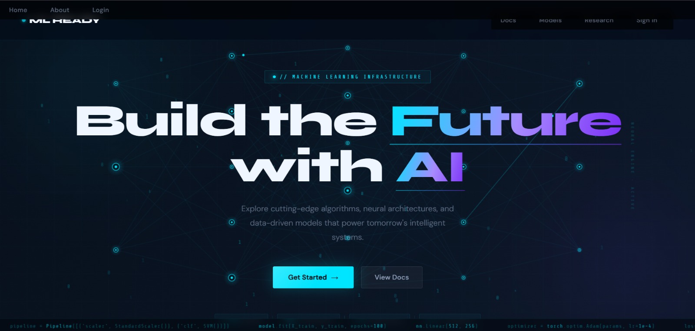
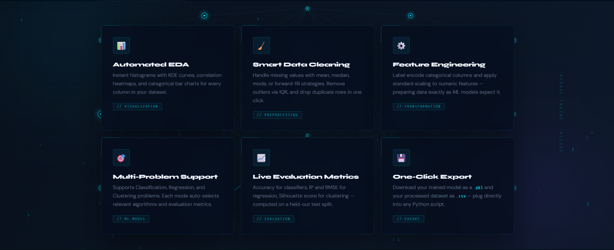
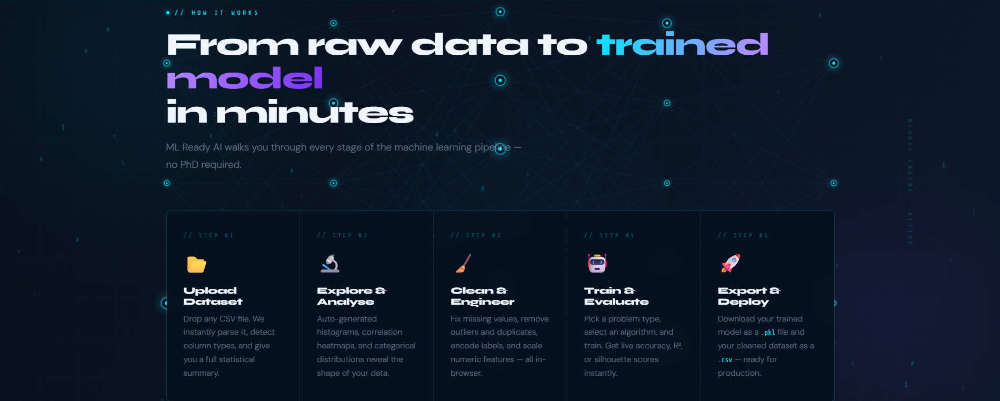
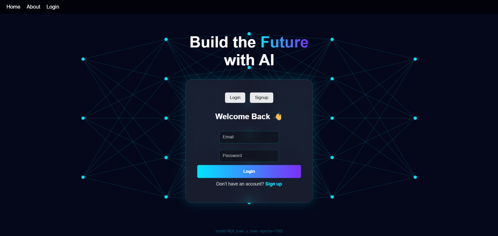
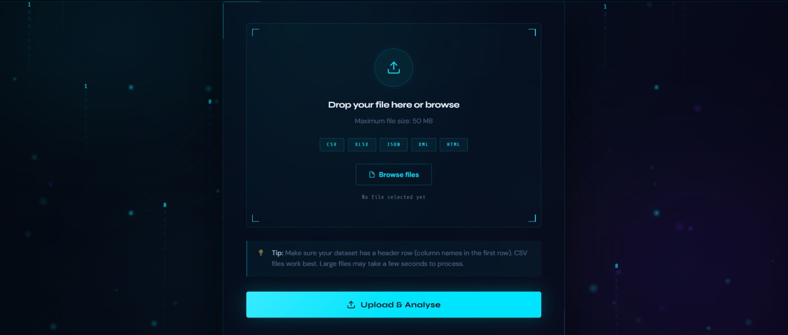
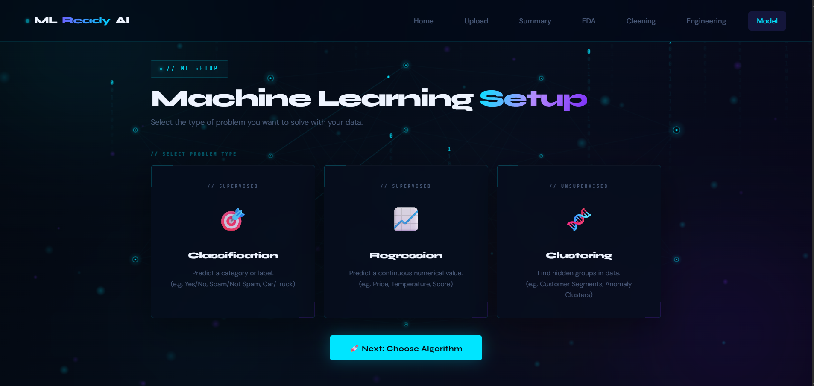
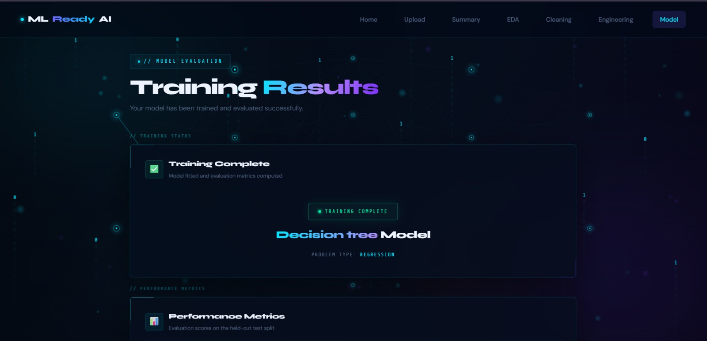
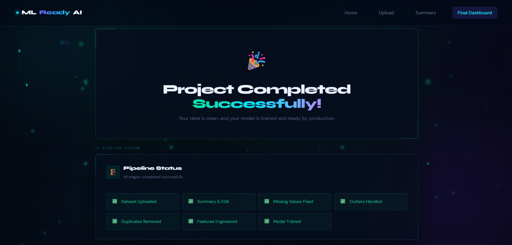
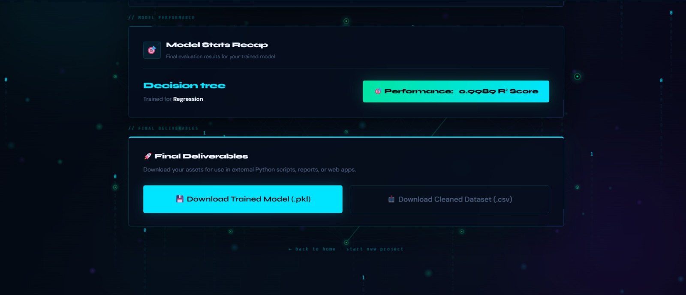

<div align="center">

# 🤖 ML Ready AI

**Build the Future with AI — from raw data to a trained, deployable model in minutes.**

An interactive AutoML web application that automates the entire machine learning pipeline — no code required.

[](https://www.python.org/)
[](https://flask.palletsprojects.com/)
[](https://scikit-learn.org/)
[](#license)

[🚀 Live Demo](https://projects-3-owb6.onrender.com) · [Report Bug](#) · [Request Feature](#)

</div>

---

## 📌 Overview

**ML Ready AI** is an interactive machine learning application built to simplify model creation and training end-to-end. Users upload their own dataset, and the system automatically performs data preprocessing, builds an appropriate model, trains it, evaluates performance, and makes the results downloadable — all through a browser, with zero code.

It's designed to demonstrate a complete ML pipeline — from data input to model deployment — and to make machine learning accessible to beginners, students, and professionals alike, without requiring advanced programming knowledge.

Validated across real-world datasets spanning **healthcare, finance, retail, solar energy, and HR**, achieving an average **R² of 0.99** (peak **R² = 0.9989**).

🔗 **Live app:** [projects-3-owb6.onrender.com](https://projects-3-owb6.onrender.com)
> Hosted on Render's free tier — the app may take 30–60 seconds to spin up on first load if it's been idle.

---

## 🎯 Objectives

- **Simplify model-building** — upload any dataset, automatically get a suitable model trained on it
- **Automate data preprocessing** — missing values, encoding, outlier handling, scaling, and dataset splitting, all without writing code
- **Provide a no-code interface** to train, evaluate, and visualize ML models
- **Demonstrate a full end-to-end ML pipeline** — data input → training → evaluation → export
- **Lower the barrier to ML** for beginners and non-programmers
- **Enable deployment** by letting users download the trained model for real-world use

---

## ✨ Key Features

- 📂 **Multi-format upload** — CSV, XLSX, JSON, XML, and HTML supported (up to 50 MB), with automatic encoding detection (UTF-8, then cp1252/Latin-1 fallback) so real-world CSVs that aren't UTF-8 still load correctly
- 🔍 **Automated EDA** — instant statistical summary, histograms, correlation heatmaps, and categorical distribution analysis on upload; degrades gracefully on pure-text datasets with no numeric columns instead of erroring
- 🧹 **Smart data cleaning** — missing values handled via mean/median/mode/forward-fill, outliers removed via IQR, duplicates dropped in one click
- ⚙️ **Automated feature engineering**:
  - **One-Hot Encoding** and **Label Encoding**, both with an automatic per-column recommendation (based on cardinality) so you don't have to guess which one fits — the right checkboxes are pre-selected for you
  - **Standard Scaling**, with automatic detection of which numeric columns are genuine continuous features vs. binary 0/1 columns produced by One-Hot Encoding — only the former are recommended and pre-checked
  - A built-in safeguard against blindly encoding free-text or near-unique ID columns (e.g. message text), which would otherwise blow up into thousands of useless columns and let models "memorize" instead of learn
- 🎯 **Multi-problem support** — Classification, Regression, and Clustering (K-Means), each with relevant algorithms and evaluation metrics
- 🤖 **Auto-Select / Benchmark mode** — automatically trains and cross-validates every supported algorithm for the chosen problem type (including auto-selecting the best K for clustering via silhouette score) and recommends the best performer, so you don't have to pick manually
- 🧠 **Live evaluation metrics** — Accuracy/Precision/Recall/F1/ROC-AUC for classifiers, R² & RMSE for regression, Silhouette score for clustering, computed via 5-fold cross-validation and a held-out test split; falls back gracefully (with an honest explanation) instead of showing broken `NaN` scores when a dataset is too small for reliable cross-validation
- 📊 **Model Performance Visualization** on the Final Dashboard — Predicted-vs-Actual + residual plots for regression, a confusion matrix heatmap for classification, and a 2D (or 1D, when only one numeric feature is available) cluster projection for clustering
- 📦 **Exportable deliverables** — download the trained model as a `.pkl` file and the cleaned dataset as a `.csv`, ready for production or further use
- 🔐 **User accounts** — login/signup flow with session-scoped feedback messages (errors and confirmations now actually render on the page, not just get lost)
- 🔁 **Session persistence** — SQLite-backed session management so your progress isn't lost mid-pipeline
- 🔒 **Environment-based configuration** — secret key and debug mode are read from environment variables rather than hardcoded, so the app is safe to deploy as-is

---

## 🖼️ Screenshots
| Landing Page | Tech Stack |
|---|---|
|  |  |

| How It Works | Login / Signup |
|---|---|
|  |  |

| Upload Dataset | Machine Learning Setup |
|---|---|
|  |  |

| Training Results | Project Completed |
|---|---|
|  |  |

| Final Deliverables |
|---|
|  |

---

## 🏗️ How It Works

ML Ready AI walks the user through a guided, sequential 8-stage pipeline — no PhD required, and nothing falls through the cracks:

| Step | Stage | What Happens |
|:---:|---|---|
| 01 | **Upload** | Drop a CSV/XLSX/JSON/XML/HTML file (up to 50 MB). The system instantly parses it, detects column types, and gives a full statistical summary. |
| 02 | **Summary** | Full statistical overview of the uploaded dataset. |
| 03 | **EDA** | Auto-generated histograms with KDE curves, correlation heatmaps, and categorical bar charts for every column. |
| 04 | **Cleaning** | Missing values handled via mean, median, mode, or forward-fill strategy; outliers removed via IQR; duplicate rows dropped in one click. |
| 05 | **Engineering** | Categorical columns One-Hot or Label encoded (recommended automatically per column), numeric features Standard-Scaled (recommended columns pre-checked, binary columns skipped automatically) — data prepared exactly as ML models expect it. |
| 06 | **Model Setup** | Choose the problem type — Classification, Regression, or Clustering — then either pick an algorithm manually or use **Auto-Select / Benchmark** to cross-validate every supported algorithm and get a recommendation. |
| 07 | **Training** | Model trains on the processed data using the manually chosen or benchmark-recommended algorithm. |
| 08 | **Results** | Live evaluation metrics (Accuracy/Precision/Recall/F1/ROC-AUC for classifiers, R² & RMSE for regression, Silhouette score for clustering) computed on a held-out test split, a Model Performance Visualization chart, plus final deliverables ready to download. |

---

## 🏛️ Architecture

```
                 ┌────────────────────┐
   User ──────▶  │   Flask REST API    │
 (CSV/XLSX/...)  │  (Jinja2 templates) │
                 └─────────┬───────────┘
                           │
                 ┌─────────▼───────────┐
                 │  SQLite (sessions)  │
                 └─────────┬───────────┘
                           │
     ┌──────────┬──────────┼──────────┬───────────┐
     ▼          ▼          ▼          ▼           ▼
   EDA   Preprocessing  Feature   Training   Evaluation
                         Engineering
                           │
                 ┌─────────▼───────────┐
                 │   Final Deliverables │
                 │  .pkl model + .csv   │
                 │   + BI dashboards    │
                 └──────────────────────┘
```

---

## 🛠️ Tech Stack

Built on the same libraries used by data scientists at leading research labs — powered by proven tools, not experimental frameworks:

| Category | Tools |
|---|---|
| **Language** | Python 3.11 |
| **Backend / Web** | Flask, Jinja2, HTML, CSS, JavaScript |
| **ML & Data** | scikit-learn, XGBoost (optional, auto-detected), pandas, NumPy |
| **Visualization** | Matplotlib, Seaborn |
| **Model Persistence** | joblib / pickle |
| **Database** | SQLite (session management) |
| **Methodology** | Agile (iterative sprints — see [Development Approach](#-development-approach)) |

---

## 🧮 Algorithms Supported

| Problem Type | Algorithms |
|---|---|
| **Classification** | Logistic Regression, Decision Tree, Random Forest, Gradient Boosting, KNN, SVM, XGBoost |
| **Regression** | Linear Regression, Decision Tree, Random Forest, Gradient Boosting, KNN, SVR, XGBoost |
| **Clustering** | K-Means (with automatic K selection, K=2–8, via silhouette score in Benchmark mode) |

Every algorithm above is available both for **manual selection** and inside **Auto-Select / Benchmark** mode, which cross-validates all of them and recommends the best performer for your dataset.

---

## ⚠️ Known Limitations

Being upfront about what this project doesn't do (yet) matters as much as what it does:

- **No NLP / text vectorization** — free-text columns (e.g. a message body) are automatically excluded from automatic encoding rather than naively one-hot/label encoded, since that would either blow up into thousands of columns or let models "memorize" exact duplicate rows instead of learning a real pattern. Datasets that are fundamentally text-classification problems (e.g. spam detection from raw message text) won't get meaningful results without adding real NLP support first.
- **Clustering only uses numeric columns** — K-Means only considers numeric features today. Applying One-Hot Encoding to a categorical column in Feature Engineering first turns it into genuine numeric (0/1) columns, so it does then get used by clustering — but a column left as raw text/category is silently excluded.
- **Single global in-memory session store** — the app is built for one user actively working with one dataset at a time (a portfolio/demo constraint), not concurrent multi-user production traffic.
- **SQLite for user accounts** — fine for a personal project or small-scale deployment, not designed for high-concurrency production use.

---

## 📊 Results

| Metric | Value |
|---|---|
| Datasets validated | 6 independent real-world datasets |
| Domains covered | Healthcare, Finance, Retail, Solar Energy, HR |
| Average R² | **0.99** |
| Peak R² | **0.9989** (Decision Tree, Regression) |
| Manual ML setup time reduction | **~70%** |

---

## ⚙️ Installation

```bash
# Clone the repository
git clone https://github.com/aakarshitpathak/ml-ready-ai.git
cd ml-ready-ai

# Create and activate a virtual environment
python -m venv venv
source venv/bin/activate      # Windows: venv\Scripts\activate

# Install dependencies
pip install -r requirements.txt

# (Optional but recommended) set a real secret key for session security
export SECRET_KEY="your-own-random-secret-key"      # Windows: set SECRET_KEY=...

# Run the app
python app.py
```

Then open **`http://localhost:5000`** in your browser.

> By default the app runs with debug mode **off** and a fallback dev secret key, so it's safe to run out of the box. Set `SECRET_KEY` for anything beyond local testing, and `FLASK_DEBUG=1` only if you need Flask's debug mode while developing.

---

## 🚀 Usage

1. **Sign up / log in** to your account
2. **Upload** a dataset (CSV, XLSX, JSON, XML, or HTML — max 50 MB). Make sure it has a header row.
3. Review the **auto-generated summary and EDA** (histograms, correlation heatmaps, distributions)
4. Let the pipeline **clean and engineer** your data automatically
5. Choose a **problem type** and train — view live performance metrics
6. **Download** your trained model (`.pkl`) and cleaned dataset (`.csv`) from the final dashboard

---

## 📁 Project Structure

A quick orientation, not an exhaustive file list:

- **`app.py`** — Flask application entry point / routes
- **`templates/`** — Jinja2 HTML pages (upload, summary, EDA, cleaning, engineering, algorithm selection, model comparison, results, final dashboard, auth)
- **`static/`** — CSS, JS, and front-end assets
- **`modules/`** — Core pipeline logic:
  - `data_loader.py` — file parsing with automatic encoding fallback
  - `data_summary.py` — dataset overview statistics
  - `eda.py` — chart generation (EDA visuals + Final Dashboard model-result charts)
  - `cleaning.py` — missing values, outliers, duplicates
  - `feature_engineering.py` — One-Hot/Label encoding, Standard Scaling, and their recommendation engines
  - `model_training.py` — preprocessing pipeline, training, cross-validation, benchmarking, clustering
  - `model_comparison.py`, `advanced_analytics.py`, `api_routes.py`, `openai_insights.py` — supporting analysis/API modules
- **`models/`** — Saved trained models (`.pkl`)
- **`requirements.txt`** — Python dependencies

---

## 🩹 Recent Improvements

A round of hardening and feature work, driven by testing against real-world datasets (imbalanced classes, non-UTF-8 CSVs, free-text columns, large row counts, single-feature clustering):

- Fixed a crash where the auto-recommended SVR/SVM model would fail to train due to a missing alias mapping
- Fixed `NaN` cross-validation scores silently appearing as "Success" on small datasets — now falls back to the held-out test score with an honest status message
- Extended Auto-Select / Benchmark mode to clustering, auto-selecting the best K via silhouette score (previously benchmarking only worked for classification/regression)
- Fixed a severe performance issue where silhouette scoring on large datasets (tens of thousands of rows) could take minutes per K value — now samples for datasets above 5,000 rows with negligible accuracy loss
- Added automatic encoding detection for CSV uploads (UTF-8 with cp1252/Latin-1 fallback), fixing uploads for real-world files that aren't UTF-8
- Fixed a crash in the dataset summary page for datasets with no numeric columns
- Added a cardinality guard against blindly one-hot encoding free-text/ID-like columns, which was previously producing misleadingly perfect (and non-generalizable) scores via row memorization, plus severe slowdowns
- Added a Model Performance Visualization chart to the Final Dashboard (predicted-vs-actual + residuals, confusion matrix, or cluster projection depending on problem type), including a 1D fallback for clustering runs with only one usable numeric feature
- Added real One-Hot Encoding support (previously only Label Encoding existed), with automatic per-column encoding recommendations
- Added automatic Standard Scaling recommendations that distinguish genuine continuous features from binary 0/1 columns (e.g. from One-Hot Encoding)
- Fixed flash messages (e.g. "Recommended model selected") leaking onto unrelated pages instead of showing on the page they were meant for, and fixed login/signup feedback messages not rendering at all
- Hardened configuration: secret key and debug mode now read from environment variables instead of being hardcoded

---

## 🧪 Development Approach

Built using an **Agile methodology** — well suited for ML systems that require continuous experimentation and refinement rather than a fixed upfront spec. Development proceeded through short sprints:

1. **Requirement Analysis**
2. **Model Development**
3. **Evaluation**
4. **UI Design**
5. **Coding**
6. **Testing**
7. **Deployment**

This allowed preprocessing logic, UI flow, and model performance to evolve iteratively based on testing across the 6 validation datasets, rather than being locked in from day one.

---

## 🔮 Future Scope

- **NLP / text feature support** — real text vectorization (TF-IDF / embeddings) for free-text columns, instead of excluding them from automatic encoding
- **Categorical features in clustering** — extend K-Means (or add algorithms like K-Prototypes) to use encoded categorical columns, not just numeric ones
- **Hyperparameter tuning in Benchmark mode** — combine algorithm selection with automatic hyperparameter search for the winning model
- **Advanced data visualization** — interactive dashboards with real-time charts, filtering, and drill-down analysis
- **Deep learning support** — CNNs for image data, RNN/LSTM for time-series and text data
- **Multi-user, production-grade session handling** — move off the single global in-memory store toward per-session, concurrency-safe state

---

## 👤 Author

**Aakarshit Pathak**

[LinkedIn](https://www.linkedin.com/in/aakarshit-p-501605264) · [GitHub](https://github.com/aakarshitpathak) · [Kaggle](https://www.kaggle.com/aakarshitpathak) · [Blog](https://free28716.wordpress.com)

---

## 📄 License

This project is licensed under the MIT License — see the [LICENSE](LICENSE) file for details.
